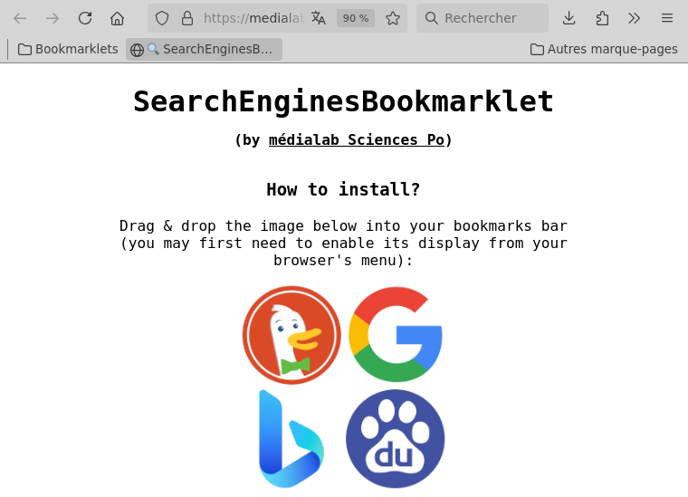
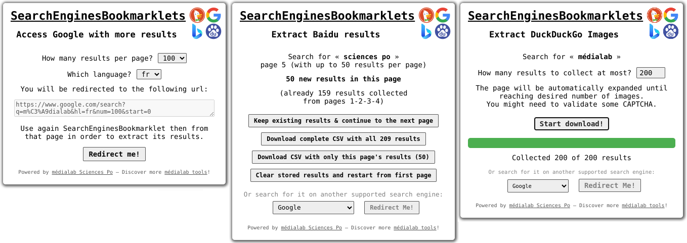

# SearchEnginesBookmarklet

Harvesting lists of urls, titles, dates and descriptions from a query on a search engine such as Google (web, images & Scholar), DuckDuckGo (web & images), Baidu, Bing or Qwant is a recurrent need in digital methods and a hardly automatable one because of those website's restrictions towards robots.

SearchEnginesBookmarklet is a low tech solution to this need by offering you an easy way to do directly from within your browser.

Install it in a few clicks from the following page: [https://medialab.github.io/SearchEnginesBookmarklet/](https://medialab.github.io/SearchEnginesBookmarklet/)

<a href="https://medialab.github.io/SearchEnginesBookmarklet/"></a>


It works as a small icon to drag and drop into your browser's bookmarks bar, allowing you to:

- first switch from a regular search results page to one with up to a 100 results per page when the search engines allows it;
- then download in one click the page's results as a CSV tabular file, or store them in the browser's memory and navigate to the next results page in order to download more results at once.




## Install local version for development

```bash
# Install node's express dependency
npm install express

# Create an HTTPS key & certificate set
openssl genrsa -out key.pem
openssl req -new -key key.pem -out csr.pem
openssl x509 -req -days 9999 -in csr.pem -signkey key.pem -out cert.pem
rm csr.pem

# Run your local HTTPS server
node serve-https.js

# Edit SearchEnginesBookmarklet.js to comment the second line and uncomment the third one

# Load the following page in your browser to accept the unsafe certificate first
https://localhost:4443/

# Then install your development version of the bookmarklet as usual by dragging and dropping the image from that page into your bookrmarks bar
```


## Credits & License

[Benjamin Ooghe-Tabanou](https://github.com/boogheta), [Julien Pontoire](https://github.com/jpontoire) & al @ [Sciences Po médialab](https://github.com/medialab)

Discover more of our projects at [médialab tools](http://medialab.sciencespo.fr/en/tools).

SearchEnginesBookmarklet is a free open source software released under [GPL 3.0 license](LICENSE).
